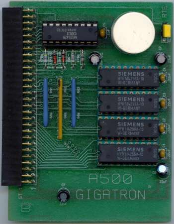
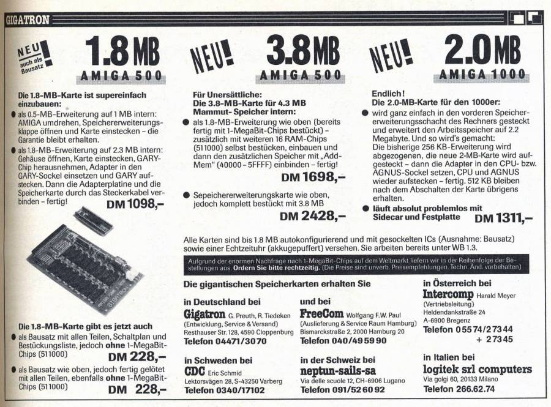
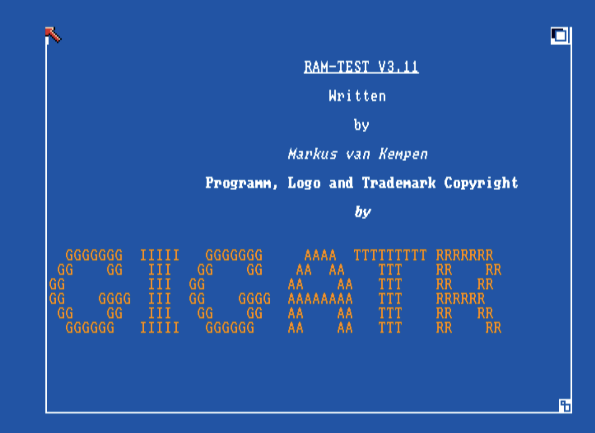
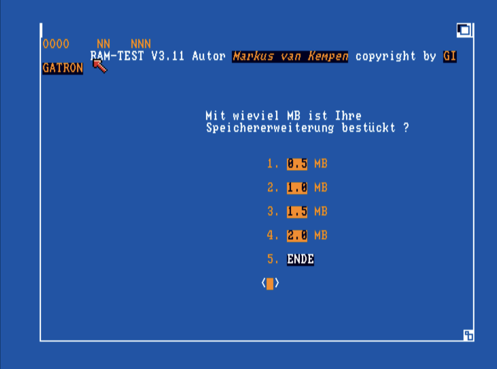
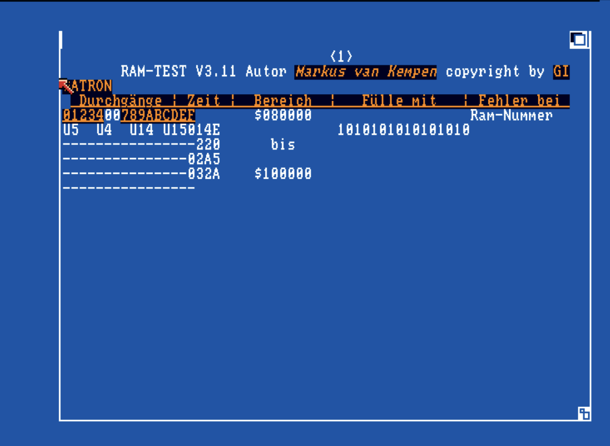
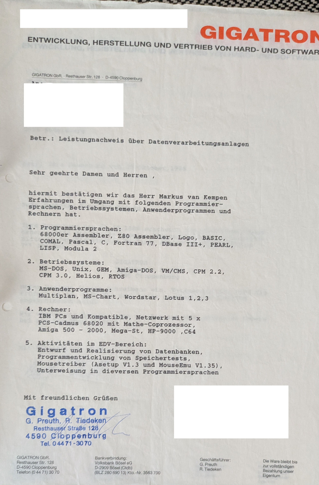

# RAM-TEST (1988): A Teenage Programmer at a Living-Room Amiga Startup


This repository is both a software recovery project and a personal story.

In 1988, as a teenager, I hung around and helped **GIGATRON** in Germany — a startup that ran, quite literally, out of a living room. There was no formal job title. We just showed up, got involved, and built things together. The hardware team made RAM expansion boards for the **Amiga 500** and **Amiga 1000**, and I wrote software to go with them.

Almost **40 years later** — while going through old files and backups — I stumbled across traces of the program. A binary here, a source fragment there. Just enough to recognise what it was and remember that it had existed. That discovery is what started this project: a thread pulled, and slowly the whole thing came back.

Recovery and documentation of **RAM-TEST** (Markus van Kempen / GIGATRON): bootable ADF images, Amiberry presets, screenshots, and public documentation. Earlier assembly fragments and build tooling live under [`internal/`](internal/) (not published to GitHub).

**Author:** Markus van Kempen — [Markus.van.kempen@gmail.com](mailto:Markus.van.kempen@gmail.com)

## Story: How RAM-TEST Was Born

In the late 1980s, memory expansion cards for Amiga systems were a big deal. Users needed reliable ways to verify if newly installed RAM was stable. At GIGATRON, the hardware team built expansion boards and sold them to Amiga users across Germany.



The board plugged into the trapdoor slot under the Amiga 500, adding 512 KB of slow RAM — and customers needed a reliable way to verify it actually worked. That's where I came in.



I wrote several versions of the program. The result that survives is a practical utility with a clear UI, repeatable memory test patterns, and diagnostics that mapped failures to specific RAM chip positions on the board.



The program would walk through the expansion RAM with alternating bit patterns, record the pass count and timing, and on failure tell you exactly which chip was at fault — useful both for GIGATRON testing boards before shipping, and for customers verifying their installation.





## Why This Repo Exists

- Preserve an early piece of my programming history.
- Document how legacy Amiga RAM diagnostics worked.
- Make the recovered binary runnable again in Amiberry.
- Archive related GIGATRON hardware photos and period material.

I also found the original work certificate from GIGATRON, which lists the programming languages and systems I was working with at the time.



## Discoverability Tags

GitHub topics (also applied to the repository):

`amiga` · `commodore-amiga` · `amiga500` · `retrocomputing` · `vintage-computing` · `68000` · `assembly` · `amiberry` · `emulation` · `software-preservation` · `digital-preservation` · `ram-test` · `hardware-diagnostics` · `demoscene` · `computer-history` · `gigatron` · `adf` · `floppy-disk` · `1980s` · `startup`

## If You Want To Feature This Story

Short description:

"In 1988, teenage programmer Markus van Kempen hung around a living-room Amiga hardware startup called GIGATRON in Germany and wrote a RAM test utility for their memory expansion boards. This repository recovers the original tool, archives period hardware photos and a work certificate, and makes the software run again in a modern Amiga emulator."

Suggested keywords:

`Amiga RAM test software, GIGATRON MiniMax, Amiga 500 memory expansion, retro software recovery, 1980s startup computing`

---

## References & External Links

### GIGATRON in the Amiga Hardware Database

GIGATRON is documented in the community-maintained [Amiga Hardware Database](https://amiga.resource.cx) — the definitive archive of Amiga expansion hardware. Their entry shows 7 catalogued products, vintage magazine advertisements, and PCB photos.

| Resource | URL |
|----------|-----|
| GIGATRON manufacturer page | [amiga.resource.cx/manuf/gigatron](https://amiga.resource.cx/manuf/gigatron) |
| MiniMax 1.8 & MiniMax Plus (A500) | [amiga.resource.cx/exp/minimax](https://amiga.resource.cx/exp/minimax) |
| Gigatron A1000 expansion (1988) | [amiga.resource.cx/exp/gigatron1000](https://amiga.resource.cx/exp/gigatron1000) |
| Gigatron 500 SE (1989) | [amiga.resource.cx/exp/gigatron500](https://amiga.resource.cx/exp/gigatron500) |
| Gigatron A500 Plus (1991) | [amiga.resource.cx/exp/gigatron500plus](https://amiga.resource.cx/exp/gigatron500plus) |
| Arriba HD — IDE controller (1990) | [amiga.resource.cx/exp/arriba](https://amiga.resource.cx/exp/arriba) |
| GigaMax 2000 — A2000 Zorro II (1990) | [amiga.resource.cx/exp/gigamax](https://amiga.resource.cx/exp/gigamax) |

**MiniMax Plus user manual (PDF, 9.7 MB):** [amiga.resource.cx/manual/MiniMax_Plus.pdf](https://amiga.resource.cx/manual/MiniMax_Plus.pdf)

Notable facts from the database:
- GIGATRON was based in Garrel / Cloppenburg, Germany (Autoconfig manufacturer ID: **2109**)
- First expansion released: **1988** — the same year RAM-TEST was written
- The MiniMax board supported 0.5 to 2 MB configurations by populating DIP sockets in groups of four, using 256k×4 (514256) chips at 70 ns or faster
- The A1000 expansion plugged into the 68000 CPU socket with a GARY adaptor board, providing up to 1.8 MB usable RAM

### Vintage advertisements (scanned, in the database)

The database preserves scanned German magazine ads for the MiniMax going back to April 1988 — exactly the period when RAM-TEST was first written.

| Ad | Date |
|----|------|
| MiniMax — Advert (DE) | [1988-04](https://amiga.resource.cx/adcoll/adcoll.pl?id=minimax&pg=1&lang=en) |
| MiniMax — Advert (DE) | [1988-05](https://amiga.resource.cx/adcoll/adcoll.pl?id=minimax&pg=2&lang=en) |
| MiniMax — Advert (DE) | [1989-01](https://amiga.resource.cx/adcoll/adcoll.pl?id=minimax&pg=4&lang=en) |
| MiniMax — Advert (DE) | [1989-05](https://amiga.resource.cx/adcoll/adcoll.pl?id=minimax&pg=5&lang=en) |
| Gigatron A1000 — Advert (DE) | [1987-10](https://amiga.resource.cx/adcoll/adcoll.pl?id=gigatron1000&pg=1&lang=en) |
| Gigatron A1000 — Advert (DE) | [1988-04](https://amiga.resource.cx/adcoll/adcoll.pl?id=gigatron1000&pg=2&lang=en) |

### Articles by Markus van Kempen in c't magazine

Five articles confirmed in the [c't archive](https://www.heise.de/select/ct/archiv) — all Amiga-related, published 1990–1992.

| Issue | Title | Subtitle | Page | Archive link |
|-------|-------|----------|------|-------------|
| c't 9/1990 | **New Generation** | Amiga 3000 im Test | p. 52–63 | [heise.de](https://www.heise.de/select/ct/archiv/1990/9/seite-52) |
| c't 10/1990 | **Commodore gab sich die Ehre** | Bericht von der Amiga DevCon '90 USA | p. 46 | [heise.de](https://www.heise.de/select/ct/archiv/1990/10/seite-46) |
| c't 4/1991 | **Daten-Regisseur** | Commodores Multimedia-Programm AmigaVision | — | [heise.de](https://www.heise.de/select/ct/archiv/1991/4) |
| c't 11/1991 | **Amiga-Styling** | Commodores 91er Entwicklerkonferenz | p. 34 | [heise.de](https://www.heise.de/select/ct/archiv/1991/11/seite-34) |
| c't 4/1992 | **Tip, Trick und Trace** | Goldene Regeln fürs Debuggen von Amiga-Software | p. 220 | [heise.de](https://www.heise.de/select/ct/archiv/1992/4/seite-220) |

*Full text requires a c't subscription. Article titles and pages verified directly from the heise issue indexes.*

### GVP (Great Valley Products) — EGS Spectrum graphics card

Markus van Kempen worked at **GVP (Great Valley Products)** on the **EGS** (Enhanced Graphics System) and the **EGS 28/24 Spectrum** — GVP's 24-bit RTG graphics card for the Amiga 2000 and 3000, released in 1993. The Spectrum used a Cirrus Logic GD5426/GD5428 chipset, supported Zorro II and Zorro III (autosensing), and could drive resolutions up to 800×600 in 24-bit and 1600×1280 in 8-bit. It is supported by Picasso96, CyberGraphX, and EGS drivers.

He later represented GVP's German distribution arm, **DTM Computersysteme**, the German market-leading distributor. In an industry survey published just after Commodore's collapse (*Amiga Magazin* 7/1994), he is quoted as the company spokesperson:

> *"Markus van Kempen, DTM Computersysteme: Der Marktführer DTW-GVP setzt trotz der ungewissen Commodore-Situation nach wie vor auf den Amiga. Die evtl. Übernahme von Commodore durch die Firma Samsung wird dem Amiga einen neuen Aufschwung geben, da ein Konzern dieser Größe über ein völlig anderes Marktpotential verfügt."*

*Samsung did not buy Commodore. Commodore filed for bankruptcy in April 1994 — the same month this issue went to press. GVP's assets were auctioned off later that year. History had other plans.*

| Resource | URL |
|----------|-----|
| GVP manufacturer page (Amiga Hardware Database) | [amiga.resource.cx/manuf/greatvalleyproducts](https://amiga.resource.cx/manuf/greatvalleyproducts) |
| EGS 28/24 Spectrum (Amiga Hardware Database) | [amiga.resource.cx/exp/egs28](https://amiga.resource.cx/exp/egs28) |
| *Amiga Magazin* 7/1994 (scan) | [archive.org/details/amiga-magazin-1994-07](https://archive.org/details/amiga-magazin-1994-07) |

### Articles in Amiga Magazin

Two articles confirmed as written by Markus van Kempen in *Amiga Magazin*, verified in the [Internet Archive scans](https://archive.org/details/amigamagazin).

| Issue | Title | Notes | Archive link |
|-------|-------|-------|-------------|
| *Amiga Magazin* 5/1995 | **Vier Datenbanken im Vergleich** | Co-author with David Göhler; comparative review of Databench, DataBase Professional, FinalData, and AmigaBase | [archive.org](https://archive.org/details/amiga-magazin-1995-05) |
| *Amiga Magazin* 7/1995 | **Im Bilde: PictureManager 2.0** | Solo review of PictureManager image catalog software, p. 36 | [archive.org](https://archive.org/details/amiga-magazin-1995-07) |

*The PictureManager review is cited as a reference in a follow-up review in Amiga Magazin 12/1995.*

---

### WhatsUp AG — Lotus Notes / Domino, Munich

When the Amiga market collapsed in the wake of Commodore's bankruptcy, Markus van Kempen moved to **Munich** to join **WhatsUp AG** — a prominent German IT and business consulting firm that had built its reputation on deep, specialized expertise in **Lotus Notes and Domino** infrastructure.

WhatsUp AG was no ordinary reseller. The company became one of the most respected Lotus/IBM technical partners in Europe, winning multiple **IBM/Lotus Beacon Awards** for engineering — recognized specifically for custom business workflow development, directory synchronization utilities, and managing complex enterprise mail migrations on the Domino platform.

The firm was also a **founding corporate member of the DNUG** (Deutsche Notes User Group e.V.) — today the largest enterprise collaborative software user group in the DACH region (Germany, Austria, Switzerland), established over 30 years ago to connect IT administrators, corporate users, and vendors in a year-round knowledge network. The DNUG's vendor relationship ran from Lotus → IBM → and now HCL Software, which acquired the Notes/Domino product line in 2019.

| Resource | URL |
|----------|-----|
| DNUG e.V. | [dnug.de](https://www.dnug.de) |
| HCL Notes (successor to IBM/Lotus Notes) | [hcltechsw.com/notes](https://www.hcltechsw.com/notes) |

---

## Technical Documentation

## Quick start (Amiberry)

```bash
./install_amiberry.sh
```

**Important:** After running the install script:
1. **Fully quit Amiberry** (Command+Q on Mac, not just close window)
2. Restart Amiberry
3. Load config: **RAM-TEST_KS13_DF0**
4. Confirm **512 KB chip + 512 KB slow** RAM in GUI
5. Boot and press menu **`1`** (0.5 MB test)

Or manually:

1. Copy `documentation/RAM-TEST_KS13_DF0.uae` → `~/Documents/Amiberry/Configurations/`
2. Copy `extracted_ramtest/RAM-TEST_emulator.adf` → `~/Documents/Amiberry/Floppies/`
3. Use a legally obtained Kickstart **1.3** ROM (`kick34005.A500.rom`) in `~/Documents/Amiberry/ROMs/` — dump from your own Amiga, or buy [Amiga Forever](https://www.amigaforever.com). **Do not download ROMs from the internet.**
4. Load the config, confirm **512 KB chip + 512 KB slow** RAM, boot, press menu **`1`**
5. Guru help: `documentation/AMIBERRY-RAM-TEST.txt`

Full usage: [`extracted_ramtest/RAM-TEST.md`](extracted_ramtest/RAM-TEST.md)

**Note:** The `.uae` configuration files contain hardcoded paths (e.g., `/Users/markusvankempen/Documents/Amiberry/`). Edit these paths to match your system, or use the provided install scripts which handle path setup automatically.

---

## Glossary

Common terms used in this documentation:

- **Bogomem**: Amiberry's emulation of slow/trapdoor RAM expansion (typically 512 KB at $00C00000)
- **Trapdoor RAM**: Physical 512 KB RAM expansion installed under the Amiga 500's trapdoor cover
- **Guru Meditation**: Amiga's crash error screen (similar to Windows BSOD), displays exception codes and fault addresses
- **Kickstart**: Amiga's boot ROM containing the operating system kernel (exec.library, graphics.library, etc.)
- **HiRes**: High-resolution display mode (640 pixels wide, ~80 text columns with 8×8 font)
- **LoRes**: Low-resolution display mode (320 pixels wide, ~40 text columns)
- **ADF**: Amiga Disk File — disk image format for floppy disks
- **HUNK**: Amiga executable file format (similar to ELF on Unix)
- **CopyMemFast**: Fast memory copy routine in exec.library (Kickstart 1.3+)

---

## File index

### Project root

| File | Description |
|------|-------------|
| [`README.md`](README.md) | This index and quick start |
| [`build_disks.sh`](build_disks.sh) | Rebuild ADF images and patched binary |
| [`install_amiberry.sh`](install_amiberry.sh) | Install RAM-TEST emulator disk to Amiberry |
| [`install_demo_amiberry.sh`](install_demo_amiberry.sh) | Install UI demo disk + `RAM-TEST_DEMO_KS13` config |
| [`gigatron.txt`](gigatron.txt) | Notes on GIGATRON / MiniMax hardware and ads |
| [`internal/`](internal/) | Private source, archive, Python build scripts — see [`internal/README.md`](internal/README.md) |

### `documentation/`

| File | Description |
|------|-------------|
| [`RAM-TEST_KS13_DF0.uae`](documentation/RAM-TEST_KS13_DF0.uae) | Amiberry preset: A500, KS 1.3, 512K slow, HiRes 640, 2× integer window (1280×512) for logo |
| [`AMIBERRY-RAM-TEST.txt`](documentation/AMIBERRY-RAM-TEST.txt) | Amiberry memory setup and Guru Meditation troubleshooting |
| [`RAM-TEST-DEMO.txt`](documentation/RAM-TEST-DEMO.txt) | UI demo disk (no RAM test, no slow RAM required) |
| [`RAM-TEST_DEMO_KS13.uae`](documentation/RAM-TEST_DEMO_KS13.uae) | Amiberry preset for UI demo |
| [`KICKSTART-ROMS.md`](documentation/KICKSTART-ROMS.md) | Verified ROM inventory, MD5s, CopyMem / CopyMemFast notes |

### `extracted_ramtest/` — public archive

#### Boot disks (ADF)

| File | Description |
|------|-------------|
| [`RAM-TEST_emulator.adf`](extracted_ramtest/RAM-TEST_emulator.adf) | **Recommended for Amiberry** — patched `ram-test`, minimal startup |
| [`RAM-TEST_KS13_DF0.adf`](extracted_ramtest/RAM-TEST_KS13_DF0.adf) | Boot from DF0 with Kickstart 1.3 only |
| [`RAM-TEST_V311.adf`](extracted_ramtest/RAM-TEST_V311.adf) | V3.11 + `testfast` + full Workbench-style `startup-sequence` |
| [`RAM-TEST_V311_minimal.adf`](extracted_ramtest/RAM-TEST_V311_minimal.adf) | V3.11 only, minimal startup |
| [`RAM-TEST_demo.adf`](extracted_ramtest/RAM-TEST_demo.adf) | **UI demo only** — FERTIG / FEHLER / ABBRUCH / MELDUNG screens (no RAM test) |

#### Executables (`c/`)

| File | Description |
|------|-------------|
| [`c/ram-test`](extracted_ramtest/c/ram-test) | V3.11 Amiga HUNK executable (7896 bytes) |
| [`c/ram-test-emulator`](extracted_ramtest/c/ram-test-emulator) | Emulator patch: no GIGATRON hardware reset |
| [`c/testfast`](extracted_ramtest/c/testfast) | Small helper to detect fast/expansion RAM (96 bytes) |

#### Startup scripts (`s/`)

| File | Description |
|------|-------------|
| [`s/startup-sequence`](extracted_ramtest/s/startup-sequence) | Original-style boot: `failat`, `testfast`, clock, `ram-test` |
| [`s/startup-sequence-ks13-boot`](extracted_ramtest/s/startup-sequence-ks13-boot) | KS 1.3 DF0 boot: only `c:ram-test` |
| [`s/startup-sequence-emulator`](extracted_ramtest/s/startup-sequence-emulator) | Same minimal script for emulator ADF |
| [`s/startup-sequence-minimal`](extracted_ramtest/s/startup-sequence-minimal) | Minimal `c:ram-test` only |
| [`s/BOOTINFO_KS13`](extracted_ramtest/s/BOOTINFO_KS13) | Short notes for KS 1.3 DF0 disk |

#### Documentation

| File | Description |
|------|-------------|
| [`RAM-TEST.md`](extracted_ramtest/RAM-TEST.md) | Full program documentation, boot, menu, Guru help |
| [`RAM-TEST-implementation.md`](extracted_ramtest/RAM-TEST-implementation.md) | SAS/C + `asm { ... }` structure (author notes) |
| [`reference/ram-test-sas-reference.c`](extracted_ramtest/reference/ram-test-sas-reference.c) | SAS/C reference reconstruction of V3.11 |
| [`RAM-TEST-VERSIONS.md`](extracted_ramtest/RAM-TEST-VERSIONS.md) | V1.41 vs V3.11, recovery limits, Kickstart compatibility |

### `images/` — reference pictures

| File | Description |
|------|-------------|
| [`1.HeaderAmiga-Logo-1985.png`](images/1.HeaderAmiga-Logo-1985.png) | Commodore Amiga logo |
| [`3.gigatron_1_sm-A500-PCB.jpg`](images/3.gigatron_1_sm-A500-PCB.jpg) | GIGATRON A500 expansion PCB photo |
| [`4.Gigatron_1989-01-A500A1000Ad.jpg`](images/4.Gigatron_1989-01-A500A1000Ad.jpg) | GIGATRON ad, 1989 (A500/A1000) |
| [`5.PraltikumGigaTronWorkCert.png`](images/5.PraltikumGigaTronWorkCert.png) | GIGATRON work / Praktikum certificate |

#### `images/Ram-Test-screenshots/`

| File | Description |
|------|-------------|
| [`0.Find-RAM-Test.png`](images/Ram-Test-screenshots/0.Find-RAM-Test.png) | Where the disk was found / recovered |
| [`1.0.RAM-Test-Abschaltung.png`](images/Ram-Test-screenshots/1.0.RAM-Test-Abschaltung.png) | Reset / shutdown warning screen |
| [`1.1.RAM-Test-GigaTronLogo.png`](images/Ram-Test-screenshots/1.1.RAM-Test-GigaTronLogo.png) | Title / logo screen |
| [`2.MemorySizeSelectionScreen..png`](images/Ram-Test-screenshots/2.MemorySizeSelectionScreen..png) | Memory size selection menu |
| [`RAM-Test-Runing.png`](images/Ram-Test-screenshots/RAM-Test-Runing.png) | Active RAM test in progress |

---

## Regenerating ADFs

```bash
./build_disks.sh
```

Requires `xdftool` (`pip install amitools`). Each ADF gets `xdftool … boot install` for a valid bootblock.

Optional one-time recovery from a source floppy ADF:

```bash
python3 internal/code/create_ramtest_adf.py /path/to/source.adf
```
